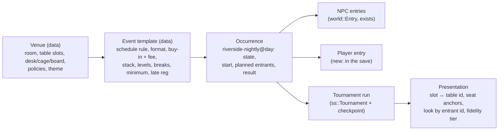

# SHORT STACK: Live Tournaments, the Foundation

Draft v1, 2026-10-03. Written against `desktop-work` at 4354ebc. Extends `GAME_DESIGN.md` §3, §6 and §7. It doesn't replace them.

**This update:** grow the Riverside from "the Sunday tournament" into the city's **local casino card room**. It runs 2 to 3 tournaments every day, with fields of 60 to 120, in a room you can walk around.

## 1. The recommendation

Build the live world by making **the Riverside** honest, busy and whole. Don't start with a bigger map.

The Riverside Sunday $150 already runs on the real tournament engine, takes real money from the bankroll, feeds the living world, and sends the player home to a text from Dee and, after a win, a cup on the windowsill. It is missing six things. Every later venue needs the same six:

1. **A schedule.** The room runs every day, and the calendar, RiverLine and the room's own screens all show it.
2. **One field.** The living world decides who enters; the tournament seats exactly those people.
3. **One entry record.** Paying, refunding and settling happen once each, survive a crash, and show up as separate ledger lines.
4. **Breaks**, and a tournament clock the world clock agrees with.
5. **A room whose table numbers are real places.** You walk to the table you were assigned.
6. **Being in the venue without being seated.** You can arrive, register, take a break, bust, and leave on your own terms.

Do them in that order, at one venue. River City Classic, the Grand Circuit and the Championship then reuse the same contracts with new rooms and data.

## 2. What exists today

Evidence: code reading at 4354ebc, and all 7 core test suites passing at that commit (golden_vectors, engine_invariants, night_one_session, riverline_ui, monkey_play, living_world, synthesized_audio). The Riverside's in-engine flow was last played on 2026-10-01 and was **not** replayed for this audit.

| System | Status | Evidence | What matters for live play |
|---|---|---|---|
| Tournament engine | **Working, tested** | `ss::Tournament` (`Tournament.h`), engine_invariants and night_one_session | Every table plays real hands with one engine. It has balancing and table breaking (`Balance`), hand-for-hand, bubble and final-table events, payouts, ICM, and late registration (`HeroAway`: the seat is held and not dealt). Walking away is `HeroSitsOut`: dealt in, check/fold until blinded off. Formats: bounties, mystery bounties, satellites. **It has no breaks, no live re-entry and no snapshot/restore.** One tick is one hand at every table. |
| The Riverside Sunday $150 | **Partial, works end to end** | `Game/Live.h/.cpp`, `BackRoomLive.cpp`, session_test `Riverside()` | One event a week, 42 to 60 entrants, 6-max. The route: Burner → `Session::GoToGame("riverside")` → the BackRoom map as a card room (`?Live=riverside`) → settle → home. See §3 for its problems. |
| Living world | **Working, tested** | `Game/World.h`, `WorldSim.cpp`, `WorldHero.cpp`, living_world | NPC careers at three fidelity tiers ("the cards are never touched"). `LiveCalendar` runs from local weeklies to the Summit. Registrations (`Pending`, `Entry`), bonds and memories, `Greeting`, and `RiversideDone`. For online events it has `HeroEntered`/`HeroFinished`. |
| Card room | **Partial** | `BackRoomStageCardRoom.cpp`, `PlaceExtras`, `SetRoomTurn` | A 28.5 × 21 m room with the player's table plus 8 others. The player's table is fixed at the origin and the room *turns* when you're moved. Other tables get three MetaHuman extras each and close when the engine's tables close. It has clock screens, the floor on the PA, and a synthesized crowd (`FCardRoomAmbience`) that thins with the room. **Its frame rate has never been measured.** |
| Being in the venue | **Absent** | `PlayWalk` (scripted paths) is the only movement | No walking, no interactions, and no input states beyond seated and menu. |
| Discovery | **Partial** | `life::Catalog` ("riverside"); `LiveCalendar` is used only by the sim | The only place the player learns about the Riverside is Dee's Burner thread. |
| Money | **Working online, thin live** | `life::State::Ledger`, `Tickets`; `LoadLive` | The live buy-in is hard-coded twice (`RiversideBuyInCents`, and `15000` in `life::Blocked`). The Riverside deducts it when the map loads and writes one *net* ledger line at the end. No travel cost. |
| Time | **Working, implicit** | `ClockMinutes`, `Session::ResumeCalendarFrom`, `World::AdvanceTo` | The Back Room keeps its own `Minutes` and writes them back. The world catches up at home. An online tournament blocks leaving. |
| Save | **Working** | `CareerSave` (.ssave, background, legacy .sav migration), `SaveData::WorldNotes` | No record of a live entry and no tournament checkpoint. |
| Home continuity | **Working** | `HomeTextFromOptions`, `Room.bTrophy = LiveBestPlace == 1`, `Life.Reads` | Dee's text matches the result. The Riverside cup appears after a win. Reads learned persist. |
| Streaming at a venue | **Absent** | Kast is home-only; `GoToGame` ends the stream | The feature table's ON AIR light is decoration. |

## 3. Rulings

Directives for every venue.

**R1. One field.** The world plans an occurrence's entrants (`World::Registered(<occurrence id>)` plus an anonymous count). The host builds the `Tournament` from that list and nothing else. Today the field comes from two places. `RiversideSpec` invents its own size, and `RiversideReserved` seats all eight of the cast every week. The world separately plans who comes, and `RiversideDone` reconciles the two afterwards.

**R2. People come because they can.** `Regular()` in `WorldSim.cpp` forces the cast into every Riverside, regardless of bankroll (Mrs. Park at 75%). Replace it with a strong home-room preference that still respects budget, form, schedule and status. Some weeks Rick is broke and doesn't show. Mei is at River City for the Classic.

**R3. Seating is a draw; moves come only from balancing.** Retire `Tournament::FeatureIds`. It swaps the cast onto the player's table seat-for-seat after every balance, which is the "secretly arranged" story this brief rules out. An honest draw puts familiar faces together anyway, most of all as the field narrows. If the room streams a feature table, that's a published policy applied **at the draw**, and the player isn't guaranteed to be at it.

**R4. One entry per player per occurrence.** The player's entry is a record in the save: entry id, occurrence id, what paid (cash or ticket), fee, state, place, prize and a settled flag. Money moves only in `Register`, `Refund` and `Settle`, each idempotent by entry id. Separate ledger lines: entry, fee, travel, prize.

**R5. Safe-save boundaries are explicit.** The game saves at registration, **after every completed hand**, at every break and at settlement. A checkpoint holds the tournament state (players, stacks, tables, tick, level, RNG state). If the game is quit mid-hand, a confirmation says "This hand will be folded." If it crashes mid-hand, the next load resumes at the start of that hand with the same deal. A registration is never lost; a buy-in is never charged twice.

**R6. Minimum field, stated.** Each event names its minimum (the Riverside's: 18 entrants, three tables). Below it the event is cancelled and every entry refunded in full; the screens say so. No invented entrants or prize money. Anonymous entrants are part of the world's planned count (their skill is in `Pending::Strength`), generated deterministically from the occurrence id. They are not padding for an unresolved rule.

**R7. Memory is what people saw.** Bonds change on observable events only: sat together, knocked out, a pot shown down, a final table, a title. Nobody remembers hole cards that weren't shown. Bonds never touch decisions about cards or chips. No soft-play or chip-dumping.

**R8. The tournament waits for walks the game starts.** A table move, the walk to your seat after a break, or "take me to my seat" never costs a hand. The engine's tick is the clock, so the tournament doesn't deal until you're seated. Only a choice the player makes with a published consequence (walking away, ignoring the break's end) can cost chips.

**R9. Presentation can't change results.** Chips, cards, eliminations and payouts come from the engine. An actor that fails to reach a chair is blinked into it. A skipped celebration settles exactly the same.

**R10. Table size.** The Riverside is a **6-max room**: its tables, seat anchors and table animation are built for six and a dealer. 60 to 120 entrants is 10 to 20 tables. A 9-handed room would need a new table rig and is a separate decision.

## 4. The Riverside Casino card room

**The place.** A riverboat casino that was moored for good in 1994. The poker room was the old showroom off the main floor. Inside:

- **Ceiling and lights:** low acoustic tiles, brass pendants over every table, a stage's proscenium arch still framing the far wall.
- **Floor:** teal-and-rust carpet worn to the backing in the aisles.
- **Front of the room:** the tournament desk (two windows), a whiteboard cash waitlist, and the **winners' wall**, a framed photo strip and a board with the last 14 days' champions.
- **The cage:** behind a brass grille.
- **Screens:** clock screens on three walls.
- **Doorway:** slot-machine chimes coming through from the main floor.
- **The rail:** a bar along the right wall where railbirds stand.
- **The break area:** the **river deck** through the glass doors. Wet railings, a vending machine with one dead row, barge lights on the black water.
- **Staff:** Dee deals weekends at the stream table. A floor manager walks the aisles with a clipboard and a radio. A chip runner pushes a racked cart.

**The schedule.** Every day; 2 events Monday to Thursday and Sunday, 3 on Friday and Saturday. Freezeouts, 6-max, a big-blind ante from level 3.

| Day | 12:00 PM | 7:00 PM | 10:30 PM |
|---|---|---|---|
| Mon to Thu | **Noon Deepstack** $80 ($70 + $10), 15,000 chips, 20-minute levels, about 60 to 80 runners | **Riverside Nightly** $120 ($105 + $15), 20,000 chips, 20-minute levels, about 70 to 100 | |
| Friday | Noon Deepstack | Riverside Nightly | **Midnight Turbo** $60 ($52 + $8), 10,000 chips, 10-minute levels, about 60 to 75 |
| Saturday | **Saturday Big Stack** $200 ($180 + $20) at 1:00 PM, 30,000 chips, 25-minute levels, about 90 to 120 | Riverside Nightly | Midnight Turbo |
| Sunday | **Sunday Warm-Up** $80 | **Riverside Sunday** $150 ($135 + $15), 20,000 chips, 20-minute levels, about 90 to 120 | |

- Late registration runs 3 levels; at the Turbo, 4.
- Breaks: 15 minutes every 6 levels; 10 minutes every 6 levels at the Turbo.
- Payouts are the engine's table, about 15% of the field paid.
- Fields come from the world's planning, so they move with the day of the week, the weather of the local scene (who's broke, who's on a heater, who's at River City), and a slow growth as the room gets a name.
- The world's own calendar holds the same events, so the regulars' careers are made here too.
- `riverside@<day>` stays the Sunday's id, so old saves and memories keep pointing at the right event.

**The room grows to fit.** It becomes roughly 36 × 30 m:
- 20 tournament tables in five rows, numbered on brass plaques.
- The stream table, under its own truss lights, roped off.
- 4 cash tables along the rail side, under the waitlist board ("1/2 NL: 3 tables, list 6").

The field is visible in the room. Tables that aren't needed are covered and dark. When a tournament table breaks, a dealer racks it and the floor calls it. Late in the night, broken tables reopen as cash games and the waitlist grows. At the final table, the whole room's light pulls in to one table.

**Fidelity.** A full-resolution MetaHuman is the costliest thing in the game (Dee's game, 5 of them: GPU 14.1 ms, hair 2.3 ms; see §12). The room keeps three tiers, by distance from the player:
- **Near:** the player's table and its neighbors get full characters and table animation.
- **Room:** other running tables get people at reduced LOD, without strand hair or shadows, on shared idle and action loops, with chips and cards moving on the engine's real hands, at a lower update rate.
- **Far:** beyond the room's middle, silhouettes with lights, sound and motion.

The engine always plays every table; only the picture thins out.

## 5. The night, step by step

| Step | What the player does | Built on | This update |
|---|---|---|---|
| Discover | The wall calendar shows today's and tomorrow's Riverside events. RiverLine gets a **Live** tab. Dee and regulars text about the weekend. | `LiveCalendar`, phone, Burner | Calendar and Live tab |
| Prepare | The event card: start, buy-in + fee, stack in big blinds, level length, breaks, late-reg close, minimum field, about how long a deep run takes, the bus fare. "Rent is due in 4 days." | `life::Blocked`, Bank | Event card with warnings |
| Travel | The 14 bus, 20 minutes, $2.90 each way. | `LoadLive`'s clock | Fare line and clock |
| Arrive | The doors from the casino floor: the desk, the screens, the room by number. | Card room | Walk mode |
| Register | At the desk, once. Repeat visits take one confirm. | R4 | Core `Register`; the desk |
| Find the seat | "Table 12, seat 4" on your ticket and the screens. Plaques, a floor arrow on request, "Take me to my seat". | Table slots | Real table slots |
| Play | The existing seated table. | `ABackRoomTable` | Unchanged |
| Breaks and moves | Breaks open the room: the deck, the vending machine, who's standing with whom. A move is a walk to a real table. | Engine breaks, `LiveMove` | Both |
| Finish | Bust: a dealer's line and you're standing in the aisle. Rail, play the next event if registration's still open, or go home. Cash: the cage. Win: your name on the wall. | `LiveOver`, `LiveSettle` | Settlement in core; staying in the room |
| Aftermath | Home: bank lines, Dee's text, the cup after a win, a message from someone you sat with, tomorrow's events on the calendar. | `HomeTextFromOptions`, `Room.bTrophy`, `Greeting` | Messages from bonds |

## 6. The venue ladder

The world calendar already has every rung, and the player's ladder is the calendar the NPCs live on.

| Stage | Venue | In the calendar | Identity |
|---|---|---|---|
| Neighborhood | **Dee's game**, the Wash & Fold's back room | `dees@<day>` | Exists. One table under a hanging lamp, dryers through the wall. |
| Local | **The Riverside Casino card room** | Sundays today; daily with this update | §4 |
| Established regular | A second room (later) | No | Deliberately different: a bright modern card club with glass and LED clocks, weekday turbos, younger online grinders playing live. |
| Traveling competitor | **River City Classic** | Monthly: $350 Deepstack, $330 satellite, $550 Main, $1,100 High Roller | A convention hotel ballroom: pipe-and-drape, three registration windows, luggage under chairs, a hotel bar that never empties. The first trip and the first hotel bill. |
| Major-event contender | **Grand Circuit** stops; the summer **Championship** | Ring events; bracelet events and the $10,000 Main | Rows to the horizon, zoned events, a feature stage with broadcast light. The floor empties as the days go. |
| Elite | **The Summit**, Monte Carlo | Invitation-only $1,000,000 | A private salon. Six tables, then one. Reputation and invitation, never bankroll alone. |

Public events stay open to anyone who can pay. Reputation gates only invitations, introductions and media. Satellites are a second road in. Tickets stay tickets (`life::State::Tickets`).

## 7. Data and responsibilities

| Owner | Owns | Never does |
|---|---|---|
| `ss::Tournament` (core) | Cards, actions, pots, stacks, levels, **breaks**, balancing, eliminations, places, payouts | Know about actors or money |
| `ss::world::World` (core) | Who enters an occurrence, NPC money and memories, history | Seat people or change results |
| `ss::Session` / `life::State` (core) | The player's money, ledger, tickets, clock and **entries** | Render anything |
| UE host (`ABackRoomGameMode`, stage, table) | Shows the night and asks for actions | Decide anything |

The flow is always: the world asks → the owner validates → the owner commits and saves → the presentation shows the result.

**Reuse:** the tournament engine, `world::Pending`/`Entry`, `LiveCalendar`, bonds and memories, `ABackRoomTable`, the card room stage, `FCardRoomAmbience`, the PA floor, the clock screens, `CareerSave`, Dee's texts and the windowsill cup.

**New (proposed names):**
- `live::Venue` and `live::EventTemplate` as data. The schedule and prices live in one place.
- `life::LiveEntry` in the save.
- Breaks in `TournamentSpec`.
- `Tournament::Write`/`Read` for checkpoints. This needs `Rng` state get/set, because sfc32's state words are private today.
- An `ss.Live.Describe` debug command.

## 8. Time

- **One clock:** world minutes. While the player has an active entry and is in the venue, the world clock **is** the tournament clock (start + hands × seconds per hand + breaks).
- **Pause freezes both.** Pausing isn't sitting out, and the pause menu says so.
- **Breaks:** a countdown on the screens and "Return to seat", which always works. At the end, the tournament resumes. If you're still on the deck by choice, you're dealt in and your blinds are posted (the published away rule).
- **No overlap:** one active entry at a time, live or online. Busting the Noon Deepstack early leaves the Nightly open, and that's a real choice.
- **Unattended:** the world never pre-resolves an occurrence the player is in.

## 9. Money

- **Register** writes entry and fee as two ledger lines and saves. **Settle** writes the prize. **Travel** writes the fare. **Refund** reverses entry and fee for a cancellation.
- Each operation is keyed by entry id. Repeating it, or reloading after it, does nothing.
- Rent stays the pressure. Shifts and Dee's game stay the way back. A bad Nightly costs $125.80 and an evening, never the career.
- Success shows up in the life sim, not the deck: the cup, the winners' wall, the bank, a reason to drop a shift.

## 10. The circuit's people

- The field is the world's people (R1). Faces are stable: a look is a hash of the entrant's id. Today a stranger gets one of 4 bodies in order of arrival (`ExtraBodies[AnonymousLooks++ % 4]`).
- The cashier and the floor learn your name after a few visits.
- On breaks, people with a bond stand together on the deck. `Bond::Label` and memories pick a line.
- Off-screen, the world keeps entering and missing events. "I played against that person at the Riverside; now we're both in the River City Main" follows from shared calendars, without any script.

## 11. Drama without a script

The floor already announces levels, busts near the money, hand-for-hand, the bubble and the final table. Add last call for registration, "Table 7 is breaking, players to the new seats on your tickets," and the room's light pulling in as tables close. Scale reactions to the event: a Nightly win is Dee's voice on the PA and your name on the wall, not confetti. Tells stay noisy. A presentation setting (Cinematic / Standard / Fast) comes later, and Fast loses nothing that matters.

## 12. Budgets (measured and target)

Measured this week on an RTX 4070 SUPER, in PIE at 2552×1222:
- **Dee's game:** 5 MetaHumans. 65 fps, with dynamic resolution holding 60 at 66% scale. GPU 14.1 ms (hair 2.3, virtual shadow maps about 3.8, TSR 1.3); game thread 10.8 ms.
- **Night One's window:** 85.6 fps, GPU 10.95 ms at 100%.
- **Background save:** about 4 ms on the game thread.
- **The current card room:** **not measured**. Measure before building on it.

Targets for this update (to verify, not promises):
- 60 fps with dynamic resolution at 75% or higher, in a full room (20 tables running).
- 6 near-tier people (the player's table and the dealer) plus at most 12 more at neighbor tables.
- Room tier capped by count.
- Loading under 10 s.
- No hitch on a per-hand save.

## 13. Scope

| This update | The same foundation, later | Out of scope now |
|---|---|---|
| The Riverside's daily schedule (§4), fields of 60 to 120, 6-max freezeouts | Bounty, re-entry and satellite events at the Riverside | Real-money or networked play |
| One field (R1), honest attendance (R2), draw and balancing (R3) | A second local room | A drivable city |
| Player entry, idempotent money, separate ledger lines (R4) | River City Classic: travel, hotel, multi-event plans | Staking, sponsorship negotiation |
| Per-hand checkpoints, crash resume (R5), minimum field (R6) | Multi-day events: bags, redraws, overnight counts | Full broadcast production |
| Breaks in the engine and the room | Feature-table seating rules, venue streaming | Crowd simulation beyond the tiers |
| The bigger room: 20 numbered tables, stream table, cash tables, desk, cage, winners' wall, river deck; walk mode | Bond-driven conversations; staff recognition | |
| Staying after a bust; going home | Grand Circuit, Championship, Summit | |
| Calendar and RiverLine **Live** tab | | |
| `ss.Live.Describe` debug | | |

## 14. A Saturday at the Riverside

Saturday, 12:10 PM. Rent's paid, $640 in the bank. The calendar has three blue cards: the Big Stack at 1, the Nightly at 7, the Turbo at 10:30. The Big Stack is $200, a third of your roll. Dee texted Thursday: "big stack's a reach. nightly's your game." You take the 14 bus ($2.90) at 6:15 for the Nightly instead.

6:40 PM. The Big Stack is still running: 31 left of 112, four tables lit in the back row, a railbird at Table 18 filming on his phone. The winners' wall says *THU NIGHTLY: SAL M. — $1,960*. At the desk: $105 + $15. "Table 12, seat 4." Table 12 is under the old proscenium. Sal's at Table 11, back to back with you, and nods. The other five at yours you've never seen. One is wearing a River City Classic lanyard.

8:00 PM. Last call for registration: 94 runners. 9:05 PM, the first break. On the river deck, Rick, who knocked you out at Dee's on Tuesday, says "You again." Mrs. Park didn't come tonight. Her player card says she played the Noon Deepstack and min-cashed.

**If you bust.** Level 11, 29 left, A♠Q♠ into Big Lou's kings. "Nice playing, seat 4." You're standing in the aisle with your jacket. The Turbo's late registration is open for another 50 minutes. The cash list for 1/2 is six names long. The 11:15 bus is the last one. You go home. The bank shows −$105, −$15, −$5.80. Dee texts "29th of 94. turbo's a lottery, good call going home." Big Lou's player card now reads "Knows you".

**If you win.** 2:40 AM. The floor calls the final table to the stream table. The room's pendants go dark one row at a time until only the truss lights are left. Heads-up against Mei, whose name was on the wall two weeks ago. Your queens hold. The cage counts out $2,215, and the cashier says "Congratulations, grinder." She finally has a name for you. Sunday, the wall says *SAT NIGHTLY: YOU — $2,215*. At home, the cup is on the windowsill. Mei's bond says "Rival". Her message: "rematch at river city?" The Classic is in 9 days, and it costs a bus, a hotel and a $550 decision.

## 15. Milestones for this update

**Status, 2026-10-03.**

- **M1 is built** (254923e). Covered by session_test and world_test, and played in the editor: registered from the Burner app, a Noon Deepstack and Nightlies, one to 11th of 97 and a cash.
- **M2 is built** (ad45abb):
  - The room is the cardroom kit and the crowd kit, plus MegaLights in this room only.
  - Measured about 63 fps, GPU 14.6 ms, with dynamic resolution holding 60 in PIE at 2552×1222 on an RTX 4070 SUPER.
  - Played: the walk in, a table move, a bust and the walk out, and a final table on the stage.
  - Not yet built from M2: walk mode and walkable breaks (breaks are timed holds), and cash tables.
- **M3 is open**, plus the parts of M2 above. An interrupted entry is settled by the leaving rule until per-hand checkpoints land.

**M1, the schedule and the honest field (core, standalone-tested, no new art)**
1. `live::Venue` and `live::EventTemplate` data: the Riverside and its weekly schedule.
2. `LiveCalendar` holds the schedule.
3. The world plans the fields; `Regular()`'s forced attendance becomes a preference.
4. The field comes from `World::Registered` plus deterministic anonymous entrants. Retire `FeatureIds`.
5. `life::LiveEntry` with `Register`/`Refund`/`Settle`, the ledger lines and the bus fare.
6. Breaks in `TournamentSpec`.
7. The minimum-field cancel.
8. The host opens any occurrence (`?Live=<occurrence id>`).

| Area | Evidence (automated) |
|---|---|
| Schedule | For 8 weeks: 2 events Mon to Thu and Sun, 3 Fri and Sat, at the published times. Every occurrence id is unique, and `riverside@<day>` is the Sunday flagship. |
| Fields | Planned fields fall within 60 to 120 over 8 simulated weeks, and vary by day. No NPC holds entries in two overlapping occurrences. Over 52 Sundays, a broke cast member misses at least one. |
| Registration | `Register` twice: one entry, one entry line and one fee line, bankroll down exactly once. Reload after registering: the same single entry. |
| Seating | Every `Moved` event in full 60- and 120-entrant runs comes from `Balance`. |
| Breaks | Each break falls on its level boundary; no hands are dealt during it; both clocks agree. |
| Settlement | `Settle` twice, or reload after settling: one prize line. |
| Minimum field | Below the minimum: cancelled, full refund, ledger reversal, and the world records a cancellation, not a winner. |
| Integrity | Engine invariants (chip conservation, legal actions) hold across 200 seeded 6-max runs of 60 to 120. |
| Regression | All 7 suites pass. Today's `.ssave` and a legacy `.sav` load. |

**M2, the room** (Blender and Unreal)
- The bigger card room per §4 and its fidelity tiers.
- Real table slots, with no turning room.
- Walk mode: desk, cage, screens, winners' wall, river deck.
- Breaks you can walk around in.
- Measure against §12 before and after. Screenshots of each area.

**M3, the aftermath and checkpoints**
- Staying after a bust, the rail, the next event, the trip home.
- The winners' wall from real results, and the cashier's recognition.
- Messages from bonds.
- `Tournament::Write`/`Read` per-hand checkpoints and crash resume (R5).
- `ss.Live.Describe`.
